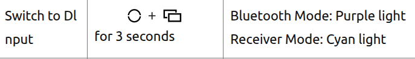

# Flydigi Dune fox
1.Appearance


2.Switch Between Platforms


3.Switch to Xlnput


4.Switch to Dlnput



# Flydigi Dune fox Usage


Install `libusb-1.0` and [Go](https://go.dev/) 1.21.5 or newer, then run `sudo make install` to install `flydigictl` and `flydigid`.
## Install `libusb-1.0`
```
sudo apt update
sudo apt install libusb-1.0-0-dev
```
## Install [Go](https://go.dev/) 1.21.5 or newer

0. 下載好了最新版 Go
```
go1.24.5.linux-amd64.tar.gz
```
1. 解壓縮並安裝到系統目錄
```
sudo rm -rf /usr/local/go  # 移除舊版本（若有）

sudo tar -C /usr/local -xzf go1.24.5.linux-amd64.tar.gz
```
2. 設定環境變數（讓 go 指令可用）
```
echo 'export PATH=$PATH:/usr/local/go/bin' >> ~/.bashrc
source ~/.bashrc
```
3. 驗證安裝成功
```
go version
```
應該會看到：
```
go version go1.24.5 linux/amd64
```
4. 回到 flydigictl 目錄安裝
```
sudo make install
or
sudo env PATH=$PATH:/usr/local/go/bin make install
```

5. To check if communication to the daemon works
```
flydigictl version
```


6. To test communication with the controller, plug it in then run
```
flydigictl info
```


# flydigictl source
1.  https://github.com/pipe01/flydigictl
2. https://manuals.plus/zh-TW/flydigi/dune-fox-gaming-controller-manual
3. https://manuals.plus/flydigi/dune-fox-gaming-controller-manual